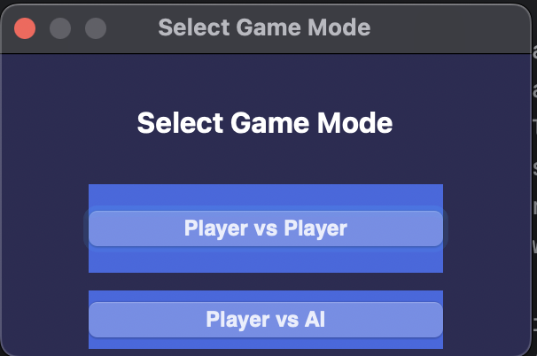
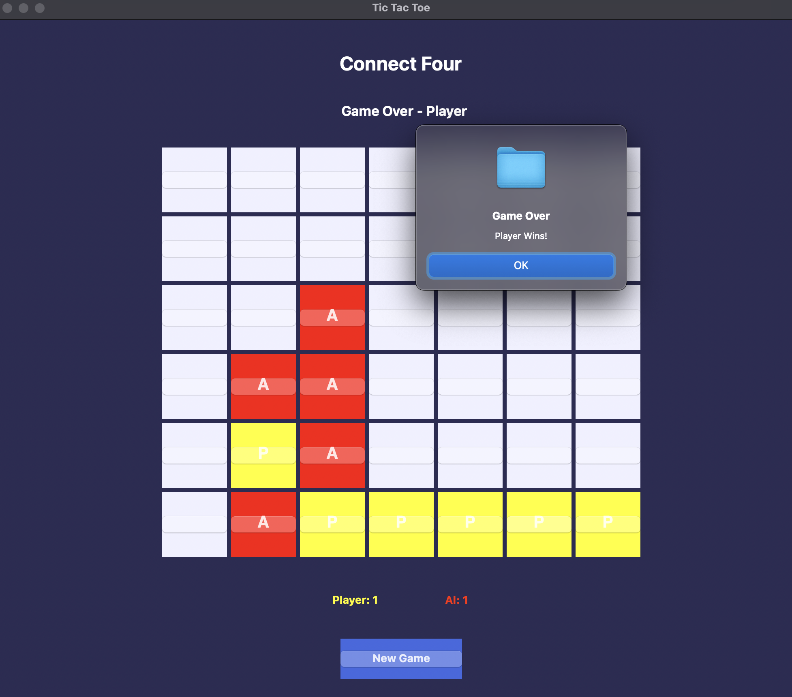
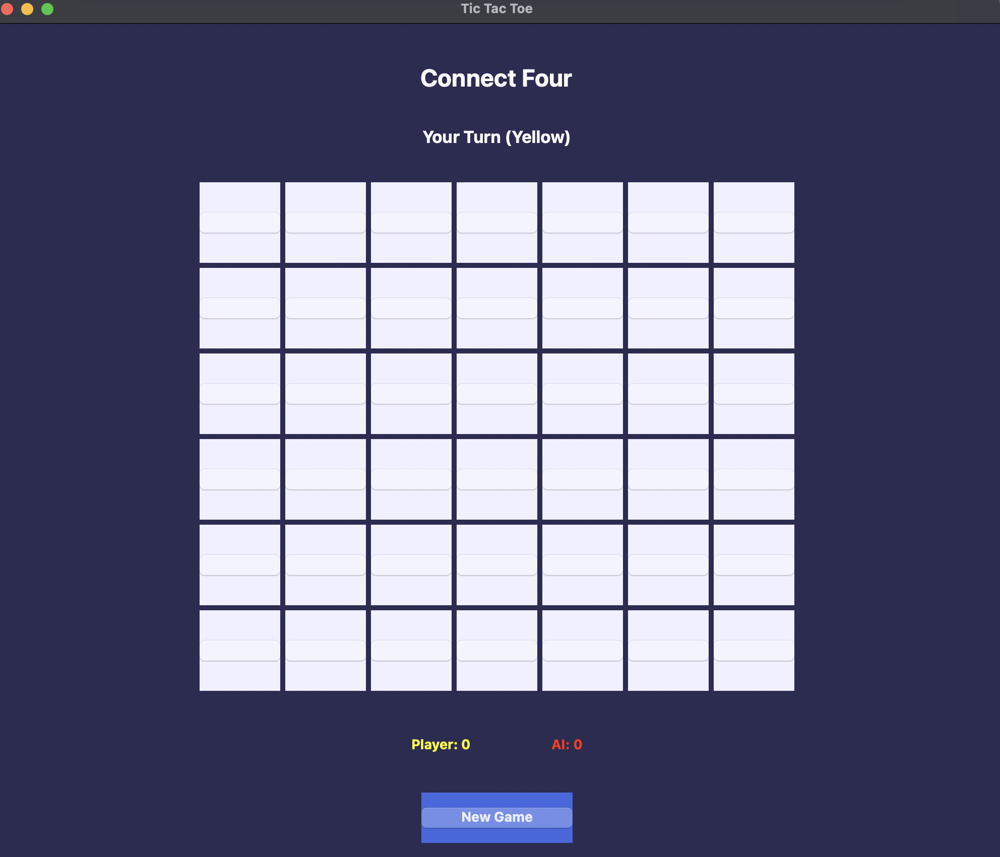
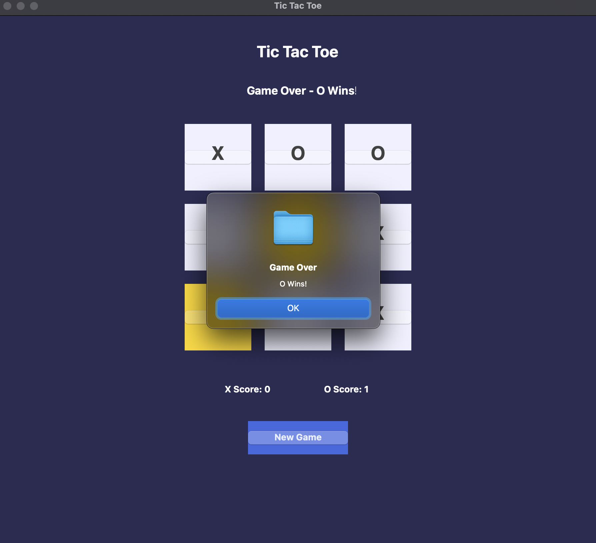

# wxWidgets Tic Tac Toe

A modern implementation of the classic Tic Tac Toe game using C++ and wxWidgets. Features both Player vs Player and Player vs AI modes with an unbeatable AI using the Minimax algorithm.

## Features

- 🎮 Two Game Modes:
  - Player vs Player (PvP)
  - Player vs AI (PvAI)
- 🤖 Unbeatable AI using Minimax algorithm with Alpha-Beta pruning
- 🎯 Score tracking system
- 🎨 Modern UI with:
  - Hover effects
  - Color-coded moves (X: Green, O: Red)
  - Golden highlighting for winning combinations
  - Clean and intuitive interface
- 🔄 New Game option with mode selection
- 📊 Real-time game status display


## Screenshots
## Screenshots

<p align="center">
  
</p>

<p align="center">
  
</p>

<p align="center">
  
</p>

<p align="center">
  
</p>

## Project Structure
```
TicTacToe/
├── src/
│   ├── MainFrame.cpp
│   ├── MainFrame.h
│   ├── GameModeDialog.cpp
│   └── GameModeDialog.h
├── CMakeLists.txt
└── README.md
```

## Requirements

- C++ compiler with C++11 support or higher
- wxWidgets 3.0 or higher
- CMake 3.0 or higher

## Building & Running

### macOS
1. Install dependencies:
```bash
brew install wxwidgets
brew install cmake
```

2. Clone the repository:
```bash
git clone https://github.com/Threadripper-ops/TicTacToe.git
cd TicTacToe
```

3. Configure CMake project:
```bash
mkdir build && cd build
cmake ..
```

4. Build the project:
```bash
make
```

5. Run the application:
```bash
./TicTacToe
```

## How to Play

1. Launch the game
2. Select game mode (PvP or PvAI)
3. In PvP mode:
   - Players take turns placing X and O
   - X goes first
4. In PvAI mode:
   - Player plays as X
   - AI plays as O
   - Player goes first
5. Win by getting three in a row (horizontally, vertically, or diagonally)
6. Press "New Game" to start over and select a new mode

## Technical Implementation

### Game Modes
1. **Player vs Player (PvP)**
   - Alternating turns between X and O
   - Score tracking for both players
   - Visual feedback for current turn

2. **Player vs AI**
   - Player plays as X (first move)
   - AI plays as O
   - Unbeatable AI implementation

### UI Features
- Color-coded moves:
  - X: Green (RGB: 0, 200, 0)
  - O: Red (RGB: 255, 0, 0)
- Background highlighting:
  - X moves: Light green
  - O moves: Light red
- Game status indicators
- Score tracking display
- Win/Draw notifications

### AI Implementation
- Uses Minimax algorithm with Alpha-Beta pruning
- Depth-based evaluation for optimal moves
- Evaluates board state considering:
  - Row combinations
  - Column combinations
  - Diagonal combinations

## Troubleshooting

### Common Issues
1. **wxWidgets not found**
   - Verify wxWidgets installation
   - Check CMAKE_PREFIX_PATH
   - Ensure wxWidgets version 3.0 or higher

2. **Build Errors**
   - Clean build directory
   - Rerun CMake configuration
   - Check compiler compatibility

3. **Runtime Issues**
   - Verify file permissions
   - Check system requirements
   - Ensure proper library paths

## Contributing

Feel free to fork the repository and submit pull requests for any improvements.

1. Fork the project
2. Create your feature branch (`git checkout -b feature/AmazingFeature`)
3. Commit your changes (`git commit -m 'Add some AmazingFeature'`)
4. Push to the branch (`git push origin feature/AmazingFeature`)
5. Open a Pull Request

## Code Citations

### Game Logic and AI Implementation
The Minimax algorithm with Alpha-Beta pruning implementation in this project was developed with reference to standard game theory concepts and common Tic Tac Toe AI implementations. The AI logic includes:
- Minimax recursive algorithm for game tree traversal
- Alpha-Beta pruning for performance optimization
- Board state evaluation for optimal move selection

### UI Framework
- Built using wxWidgets framework
- Dialog implementation based on wxWidgets documentation and examples

### References
- wxWidgets Documentation: https://docs.wxwidgets.org/
- Minimax Algorithm: https://en.wikipedia.org/wiki/Minimax
- Alpha-Beta Pruning: https://en.wikipedia.org/wiki/Alpha-beta_pruning

## License

This project is licensed under the MIT License. See the [LICENSE](LICENSE) file for details.

## Author

Threadripper-ops
```

This documentation:
1. Provides a complete overview of the project
2. Includes detailed setup instructions
3. Details technical implementations
4. Includes troubleshooting guidance
5. Maintains proper citations and licensing
6. Uses clear formatting and structure
