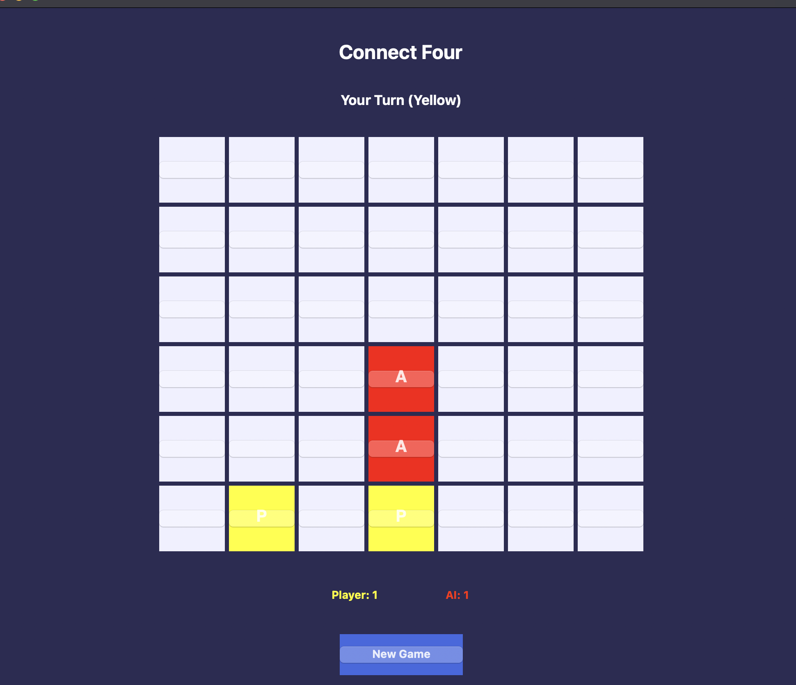
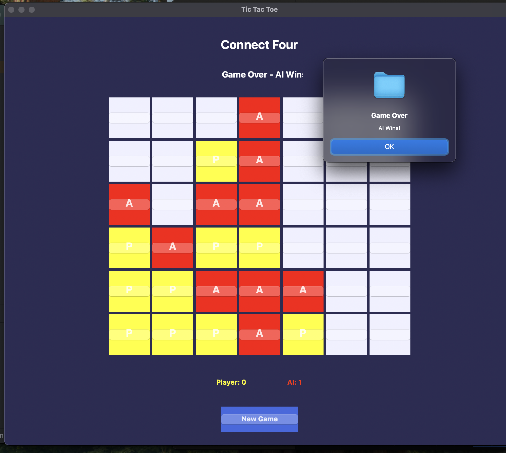

# Connect 4

A modern implementation of the classic Connect 4 game using C++ and wxWidgets. Features both Player vs Player and Player vs AI modes with a sophisticated AI using the Minimax algorithm with Alpha-Beta pruning.

## Features


  - Player vs AI (PvAI)
- 🤖 Smart AI using Minimax algorithm with Alpha-Beta pruning
- 🎯 Score tracking system
- 🎨 Modern UI with:
  - Column hover effects
  - Color-coded pieces (Player 1: Red, Player 2: Yellow)
  - Flashing animation for winning combinations
  - Clean and intuitive interface
- 🔄 New Game option with mode selection
- 📊 Real-time game status display

## Screenshots

<p align="center">
  
</p>

<p align="center">
  
</p>

<p align="center">
  
</p>

<p align="center">
  
</p>

## Project Structure
```
Connect4/
├── src/
│   ├── MainFrame.cpp
│   ├── MainFrame.h
│   ├── GameModeDialog.cpp
│   └── GameModeDialog.h
├── CMakeLists.txt
└── README.md
```

## Requirements

- C++ compiler with C++11 support or higher
- wxWidgets 3.0 or higher
- CMake 3.0 or higher

## Building & Running

### macOS
1. Install dependencies:
```bash
brew install wxwidgets
brew install cmake
```

2. Clone the repository:
```bash
git clone https://github.com/Threadripper-ops/Connect4.git
cd Connect4
```

3. Configure CMake project:
```bash
mkdir build && cd build
cmake ..
```

4. Build the project:
```bash
make
```

5. Run the application:
```bash
./Connect4
```

## How to Play

1. Launch the game
2. Select game mode (PvP or PvAI)
3. In PvP mode:
   - Players take turns dropping pieces
   - Red plays first
   - Click on a column to drop a piece
4. In PvAI mode:
   - Player plays as Red
   - AI plays as Yellow
   - Player goes first
5. Win by connecting four pieces in a row (horizontally, vertically, or diagonally)
6. Press "New Game" to start over and select a new mode

## Technical Implementation

### Game Modes
1. **Player vs Player (PvP)**
   - Alternating turns between Red and Yellow pieces
   - Score tracking for both players
   - Visual feedback for current turn

2. **Player vs AI**
   - Player plays as Red (first move)
   - AI plays as Yellow
   - Strategic AI implementation

### UI Features
- Color-coded pieces:
  - Player 1: Red (RGB: 255, 0, 0)
  - Player 2: Yellow (RGB: 255, 215, 0)
- Column highlighting on hover
- Piece dropping animation
- Game status indicators
- Score tracking display
- Win/Draw notifications

### AI Implementation
- Uses Minimax algorithm with Alpha-Beta pruning
- Depth-based evaluation for optimal moves
- Evaluates board state considering:
  - Horizontal combinations
  - Vertical combinations
  - Diagonal combinations
  - Threat detection and blocking

## Troubleshooting

### Common Issues
1. **wxWidgets not found**
   - Verify wxWidgets installation
   - Check CMAKE_PREFIX_PATH
   - Ensure wxWidgets version 3.0 or higher

2. **Build Errors**
   - Clean build directory
   - Rerun CMake configuration
   - Check compiler compatibility

3. **Runtime Issues**
   - Verify file permissions
   - Check system requirements
   - Ensure proper library paths

## Contributing

Feel free to fork the repository and submit pull requests for any improvements.

1. Fork the project
2. Create your feature branch (`git checkout -b feature/AmazingFeature`)
3. Commit your changes (`git commit -m 'Add some AmazingFeature'`)
4. Push to the branch (`git push origin feature/AmazingFeature`)
5. Open a Pull Request

## Code Citations

### Game Logic and AI Implementation
The Minimax algorithm with Alpha-Beta pruning implementation in this project was developed with reference to standard game theory concepts and common Connect 4 AI implementations. The AI logic includes:
- Minimax recursive algorithm for game tree traversal
- Alpha-Beta pruning for performance optimization
- Board state evaluation for optimal move selection
- Position evaluation heuristics specific to Connect 4

### UI Framework
- Built using wxWidgets framework
- Dialog implementation based on wxWidgets documentation and examples

### References
- wxWidgets Documentation: https://docs.wxwidgets.org/
- Minimax Algorithm: https://en.wikipedia.org/wiki/Minimax
- Alpha-Beta Pruning: https://en.wikipedia.org/wiki/Alpha-beta_pruning
- Connect Four Strategy: https://en.wikipedia.org/wiki/Connect_Four#Mathematical_solution

## License

This project is licensed under the MIT License. See the [LICENSE](LICENSE) file for details.

## Author

Threadripper-ops
